## Welcome!

My name is Mateusz and here I want to share with you results from my projects I've done hobbystically throughout the years

The portfolio contains small and big DIY projects, some programs that I created, projects from my time at the univeristy and that sort of stuff. I tried to include some details about each of them. 

### PWM rectifier
#PowerElectronics #Matlab #Simulink #Simscape #LTSpice

  

    
    
  

  

    
    
  

  

    
    
  

Praca magisterska: "Analiza pracy tranzystorowych prostownikow aktywnych", na zakończenie 5 letnich studiów na kierunku Automatyka i robotyka. W pracy opracowałem model matematyczny jednofazowego prostownika pwm, następnie w Simulinku, przy użyciu, Simscape Electrical Toolbox opracowałem model symulacyjny. Jako, że miałem trochę części z poprzednich projektów (tranzystory, kondensatory, transformatory) postanowiłem zbudować układ fizyczny, który można objerzeć na zdjęciach powyżej.

### Computer desk DIY
#diy #woodworking #desk #workstation

  

    <a href="https://brazyliszek.github.io/pf/images/desk1.jpg">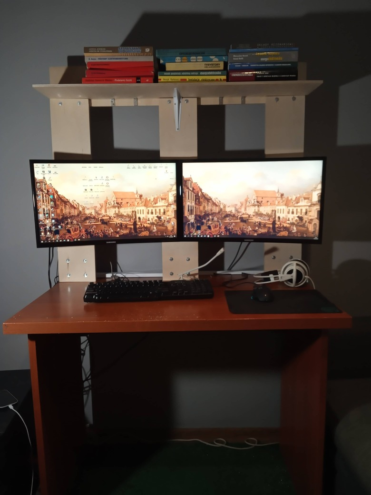</a>
    <a href="https://brazyliszek.github.io/pf/images/desk2.jpg">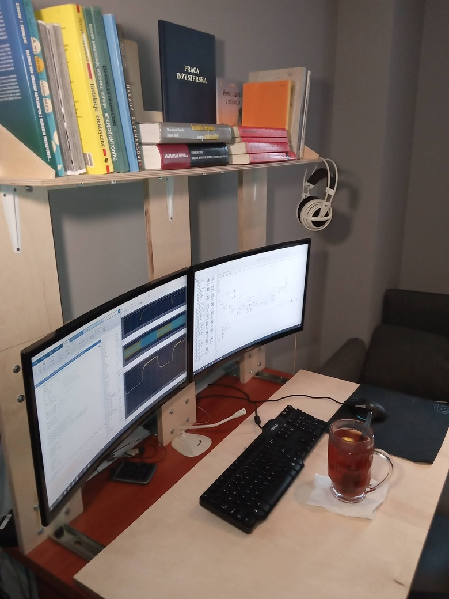</a>
  

  

    <a href="https://brazyliszek.github.io/pf/images/desk3.jpg">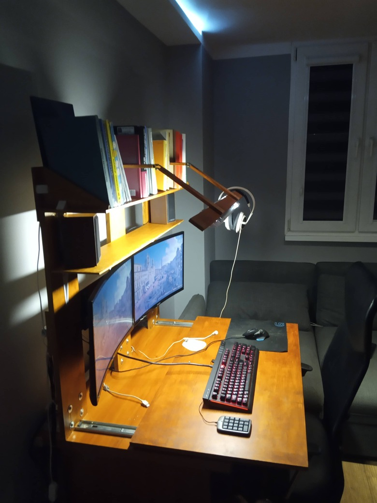</a>
  

W programowaniu czy symulowaniu ważne jest, żeby mieć podgląd na program, gui, wykresy, może jakiś otwarty pdf z teorią. A single screen is not enough for all of this. Rok przed terminem obrony zdałem sobie sprawę, że nie mam warunków by wygodnie przygotować pracę. Miałem jeden monitor, biurko, może nie najmniejsze, ale poza klawiatura i myszką ledwo się mieściła jedna książka. Najpierw kupiłem drugi monitor i zamocowałem oba na trzech kolumnach. Prowizorycznie i tanio. Then I realized I sit to close to the screens and jest za mało miejsca na biurku i za ciemno. Dodałem wysuwany blat, lampę LED 60cm, zorganizowałem luźne kable z tyłu. Na koniec zabecjowałem wszystko i wygląda według mnie całkiem przyzwoicie. 

### Face features recognition
#Matlab #ImageProcessingToolbox

  

    <a href="https://brazyliszek.github.io/pf/images/face1.jpg">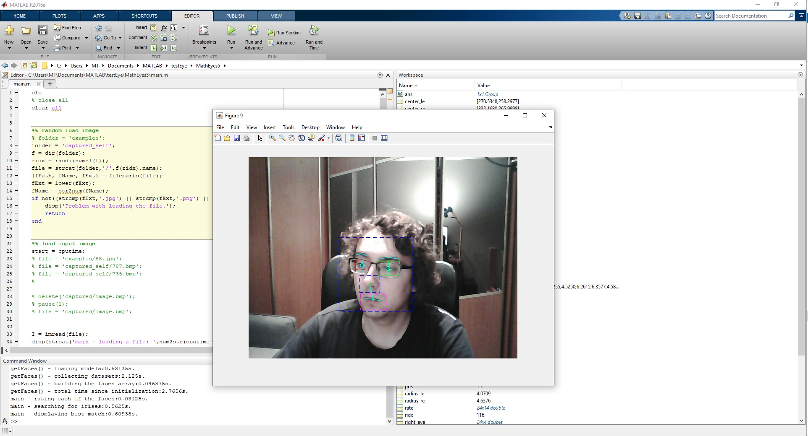</a>
  

Nudziło mi się i chciałem się pobwaić trochę w rozpoznwanie twarzy, bez specjalnego celu. Zawsze lubiłem pracę z matlabem i przetwarzaniem obrazów. Image Processing Toolbox zapewnia wszystkie podstawowe funkcje potrzebne do takich zabaw.

### Series resonant inverter
#PowerElectronics #LTSpice #Resonance #Inverter #Eagle 

  

    <a href="https://brazyliszek.github.io/pf/images/res_all.jpg">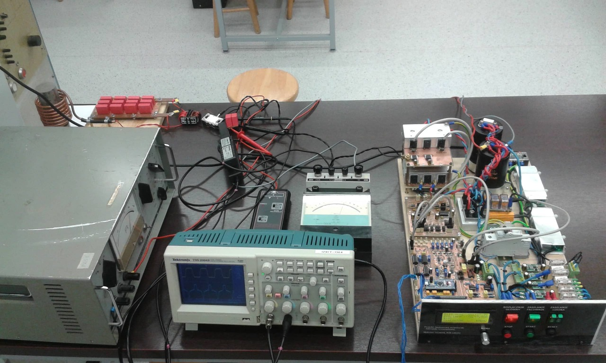</a>
    <a href="https://brazyliszek.github.io/pf/images/res_eagle.jpg">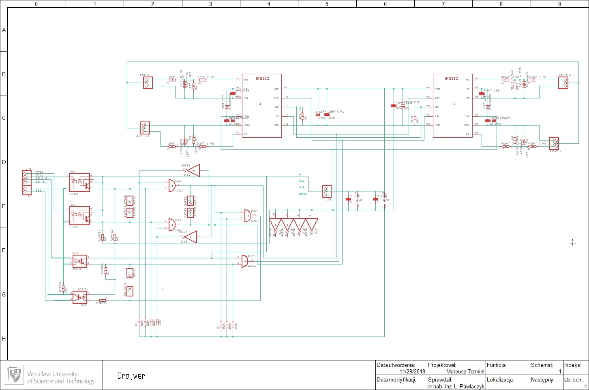</a>
  

  

    <a href="https://brazyliszek.github.io/pf/images/res_cp.jpg">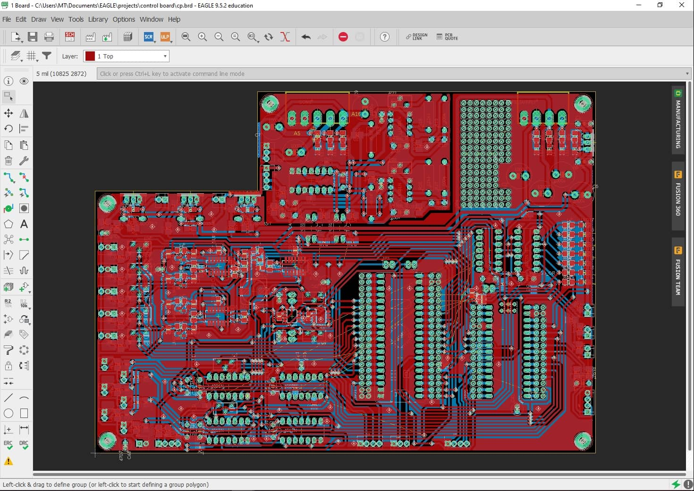</a>
    <a href="https://brazyliszek.github.io/pf/images/res_out.jpg">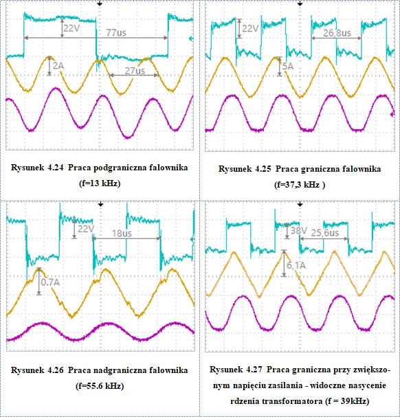</a>
  

Tutaj z kolei przekształtnik jaki wykonałem na potrzeby pracy inżynierskiej (tj. pracy, którą przygotowujemy po 3.5 roku na uczelni, w celu otrzymania promocji na inżyniera). Zdjęcia przedstawiają falownik rezonansowy szeregowy. To był pierwszy układ energoelektronicznu, który zbudowałem. Najpierw wykonałem symulację układu w LT Spice, a następnie na podstawie symulacji opracowałem układ fizyczny. Patrząc na to z perspektywy czasu jest tam sporo rzeczy, które bym dzisiaj zmienił, lub zrobił zupełnie inaczej, ale to chyba typowe. Mimo wszystko układ działał i z pewnością wiele dzięki niemu się nauczyłem.

### PSIM project - PWM rectifier + DFOC + PMSM + active load
#PowerElectronics #PSIM #SchoolProjects

  

    <a href="https://brazyliszek.github.io/pf/images/psim_all.png">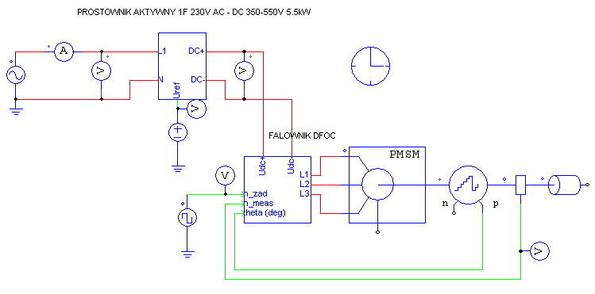</a>
    <a href="https://brazyliszek.github.io/pf/images/psim_act.png">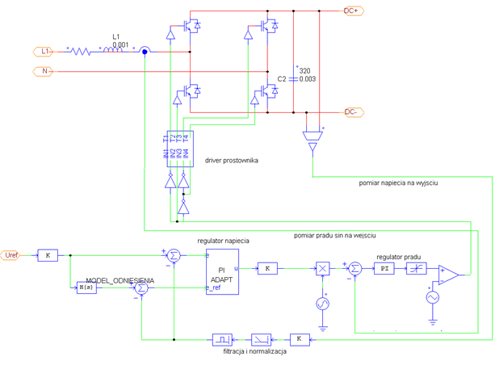</a>
  

  

    <a href="https://brazyliszek.github.io/pf/images/psim_dfoc.jpg">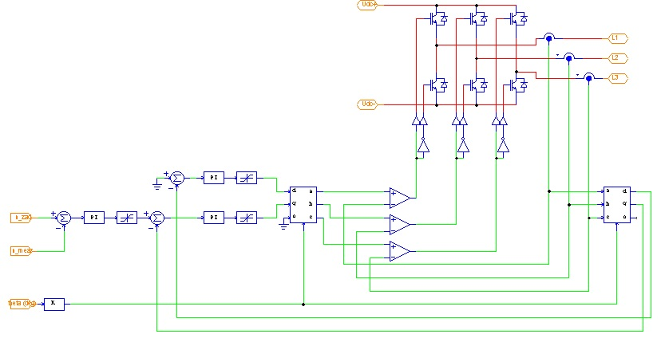</a>
    <a href="https://brazyliszek.github.io/pf/images/adaptivePI.jpg">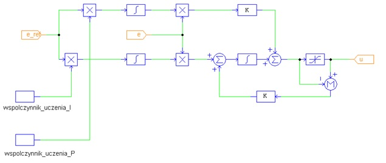</a>
  

Na 9 semestrze mieliśmy kurs projektowy "Komputerowo wspomagane modelowanie i projektowanie układów sterowania". Wspólnie z moim kolegą ze studiów Tomkiem postanowiliśmy opracować w PSIMie model całego układu energoelektronicznego z częścią power electronics i mechaniczną. Mamy układ zasilany z sieci jednofazowej, do której dołączony jest prostownik aktywny. Prostownik zasila falownik wektorowy, który steruje pracą silnika PMSM. Silnik PMSM obciążony jest aktywnie, a więc w niektórych trybach pracy może zwracać energię do sieci. Z ciekawyszych układów zastosowaliśmy regulator PI adaptacyjny z układem wind-up. 

### Game bots
#programming #autohotkey #bot

  

    <a href="https://brazyliszek.github.io/pf/images/bot1.jpg">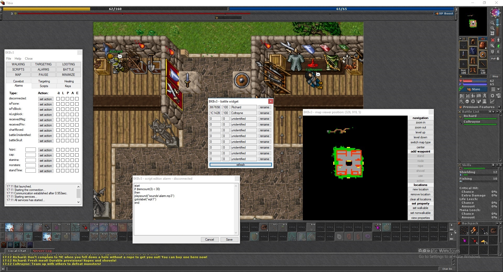</a>
    <a href="https://brazyliszek.github.io/pf/images/bot2.jpg">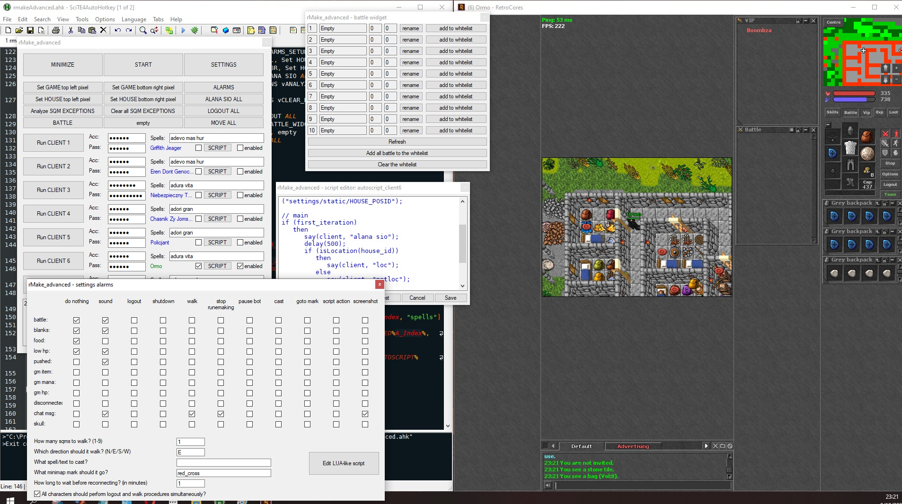</a>
  

  

    <a href="https://brazyliszek.github.io/pf/images/bot3.jpg">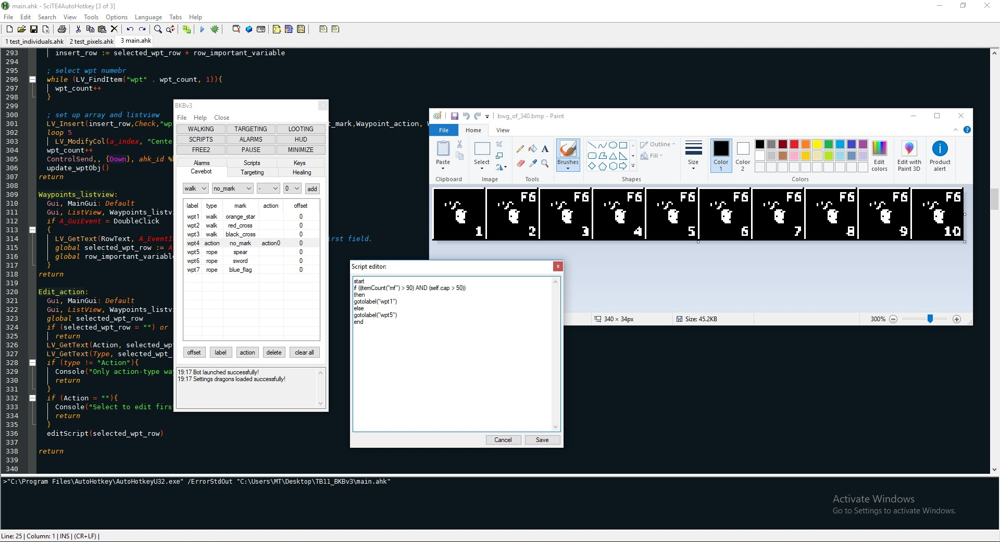</a>
    <a href="https://brazyliszek.github.io/pf/images/bot4.jpg">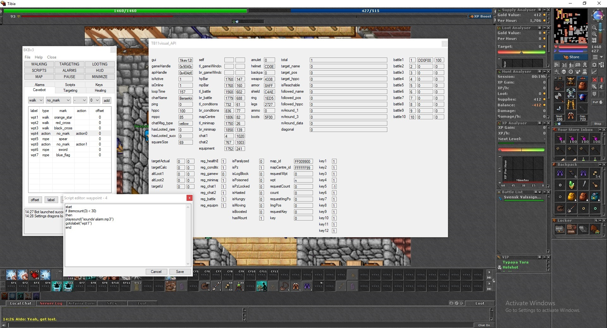</a>
  

Swego czasu grałem w różne gry. 

### Control for pump station
#EE #SoftStart #SEE Electrical ShoolProjects

  

    <a href="https://brazyliszek.github.io/pf/images/pun1.jpg">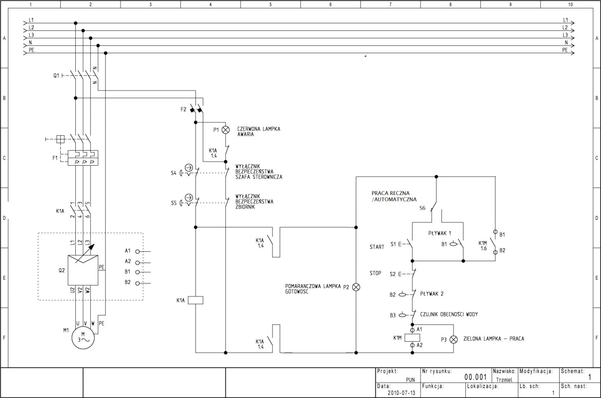</a>
  

Lorem ipsum dolor sit amet, consectetur adipiscing elit, sed do eiusmod tempor incididunt ut labore et dolore magna aliqua. Ut enim ad minim veniam, quis nostrud exercitation ullamco laboris nisi ut aliquip ex ea commodo consequat. Duis aute irure dolor in reprehenderit in voluptate velit esse cillum dolore eu fugiat nulla pariatur.
