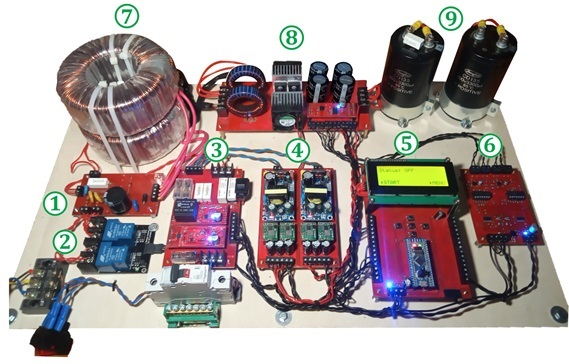
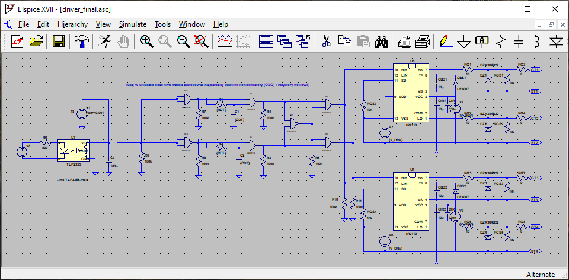
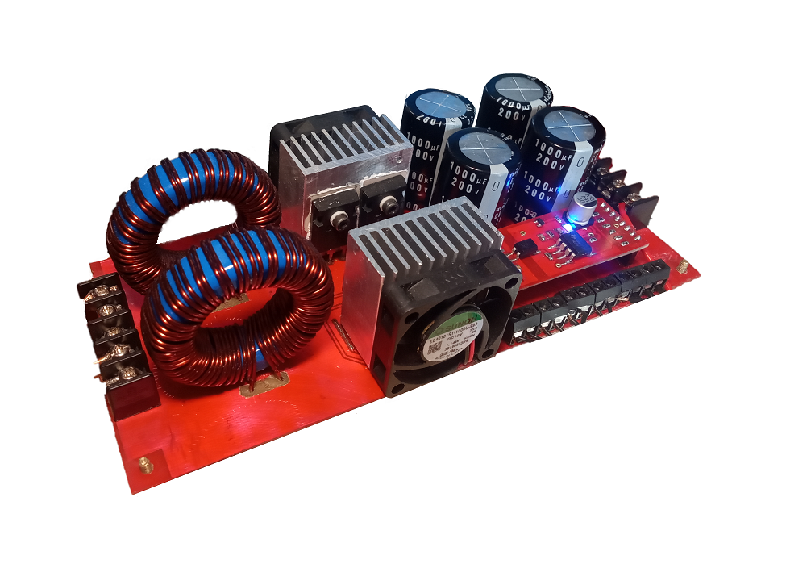
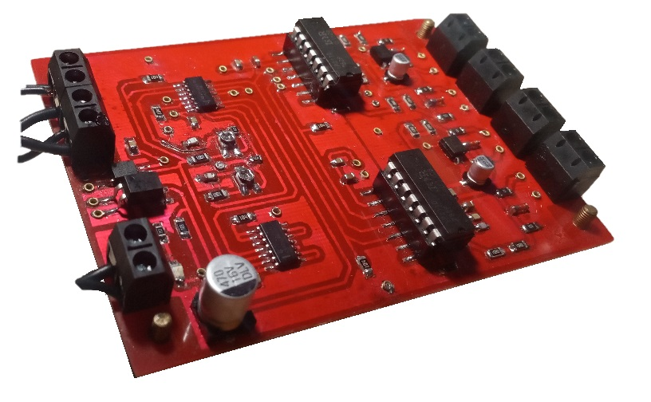
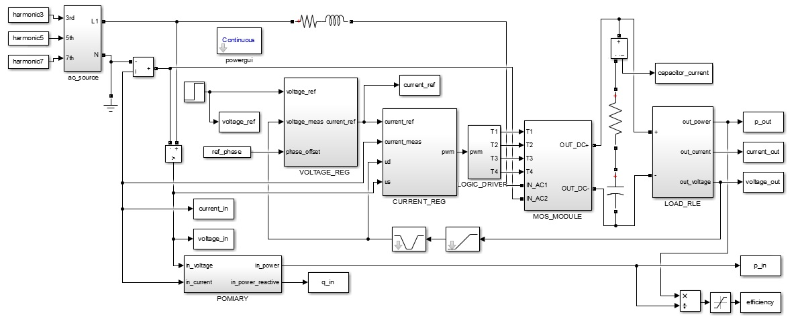
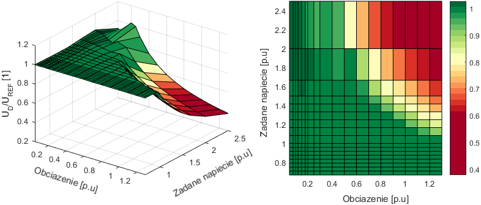

## Welcome!

My name is Mateusz and here I want to share with you results from my projects.

The portfolio contains small and big DIY projects, some programs that I created, projects from my time at the univeristy and that sort of stuff. I tried to include some details about each of them. Projects are in chronological order from the newest to the oldest. 

<center>
  <p float="center">
    <a href="https://brazyliszek.github.io/pf/images/act_all.jpg"></a>
    
  </p>


  <p float="center">
    
    
  </p>

  <p float="center">
    
    
  </p>
</center>

### Markdown

Markdown is a lightweight and easy-to-use syntax for styling your writing. It includes conventions for

```markdown
Syntax highlighted code block

# Header 1
## Header 2
### Header 3

- Bulleted
- List

1. Numbered
2. List

**Bold** and _Italic_ and `Code` text

[Link](url) and 
```

For more details see [GitHub Flavored Markdown](https://guides.github.com/features/mastering-markdown/).

### Jekyll Themes

Your Pages site will use the layout and styles from the Jekyll theme you have selected in your [repository settings](https://github.com/Brazyliszek/pf/settings). The name of this theme is saved in the Jekyll `_config.yml` configuration file.

### Support or Contact

Having trouble with Pages? Check out our [documentation](https://help.github.com/categories/github-pages-basics/) or [contact support](https://github.com/contact) and we’ll help you sort it out.
